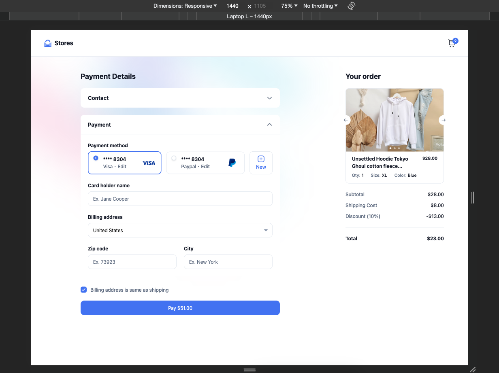
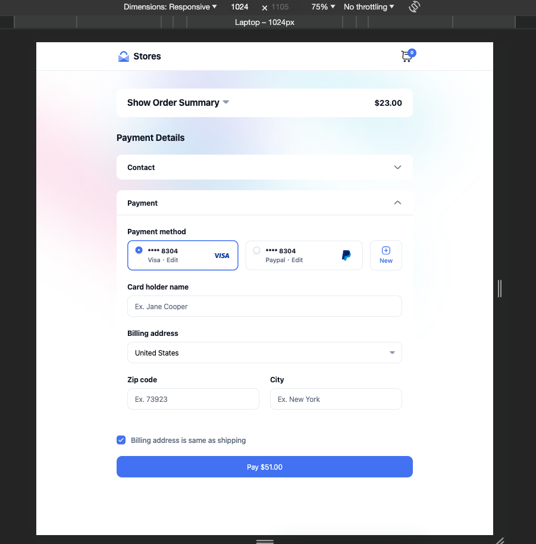
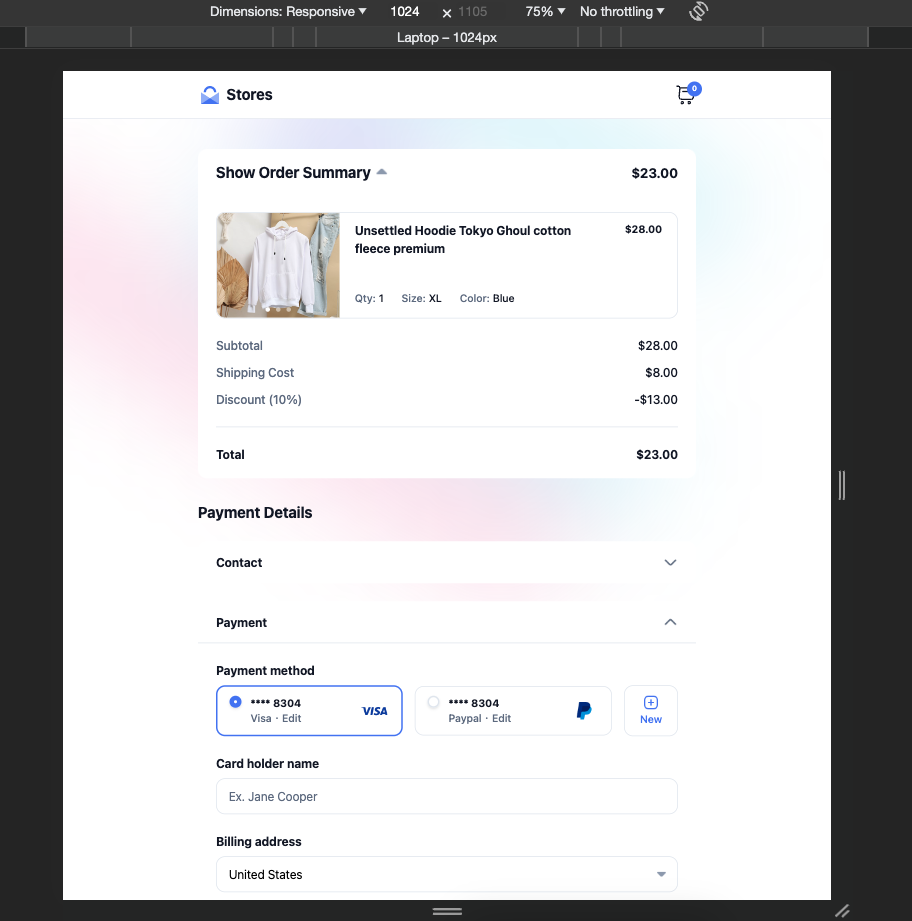
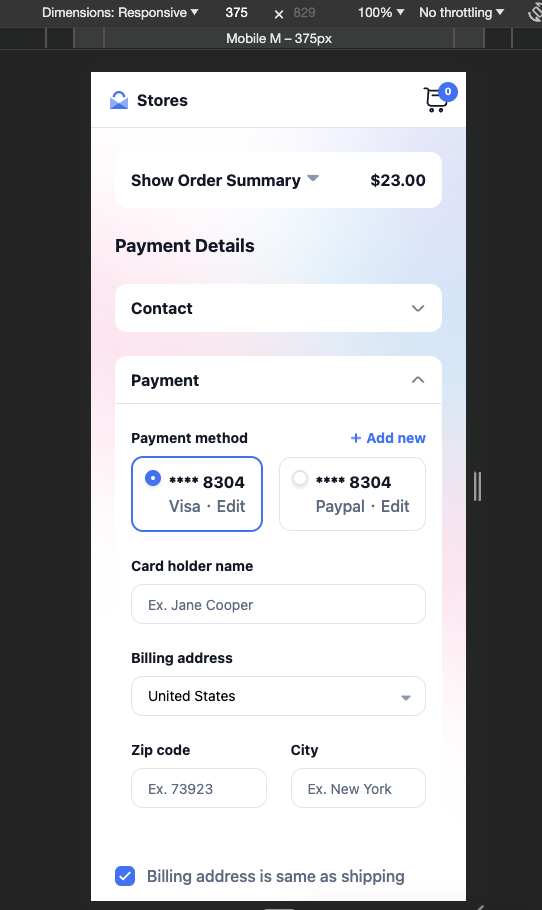
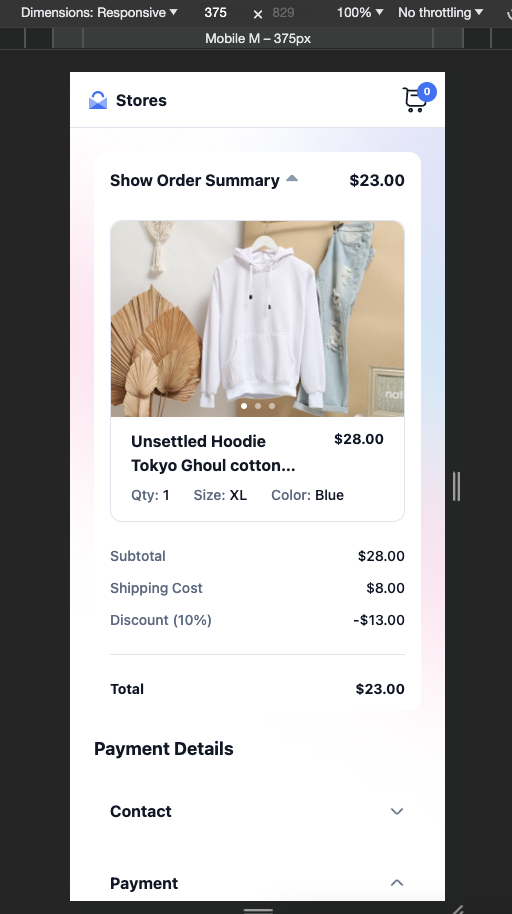
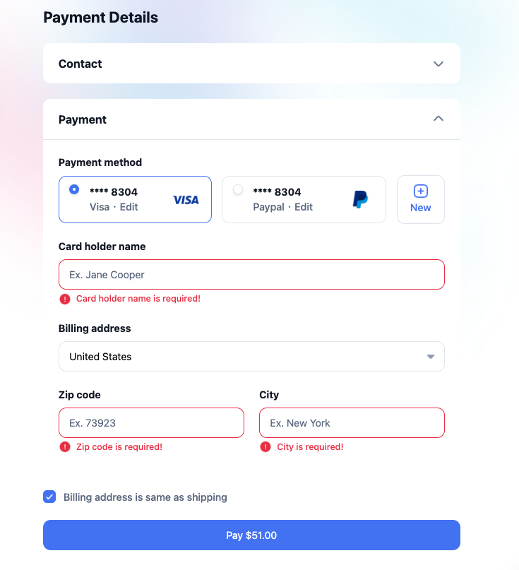
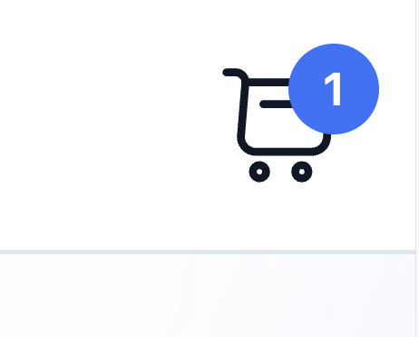
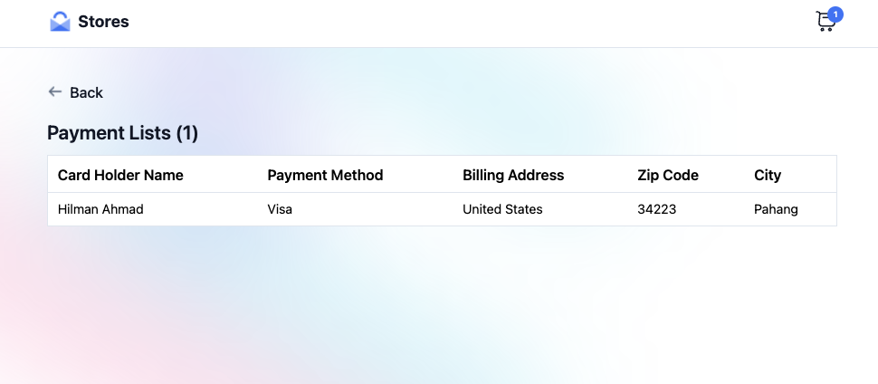

# PAYMENT STORE APPS

This project was generated with [Angular CLI](https://github.com/angular/angular-cli) version 15.0.4. This project use NgRx for state management, store data at local storage and TailwindCSS as CSS Framework.

### Preview

1. Screen for Desktop (1440px and above)

2. Screen for Tablet (1024px to 1439px) - with close Order Summary collapsible

3. Screen for Tablet (1024px to 1439px) - with open Order Summary collapsible

4. Screen for Mobile (375 to 1023px) - with close Order Summary collapsible

5. Screen for Mobile (375 to 1023px) - with open Order Summary collapsible

6. Error Handling when insert payment information - using FormGroup

7. Updating Cart (top right corner) with bubble number when submit payment form - using NgRx that dispatch the increment with initialState of localStorage length

8. List Screen (when click Cart icon on top right corner) - routerLink to go to /link page

